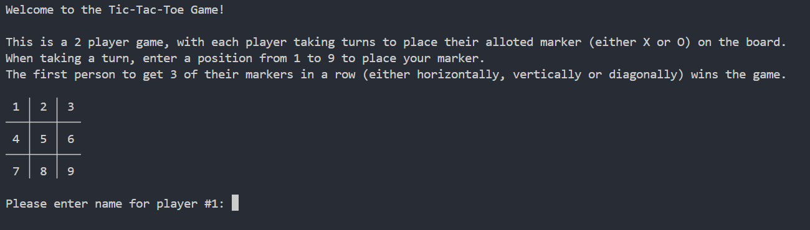
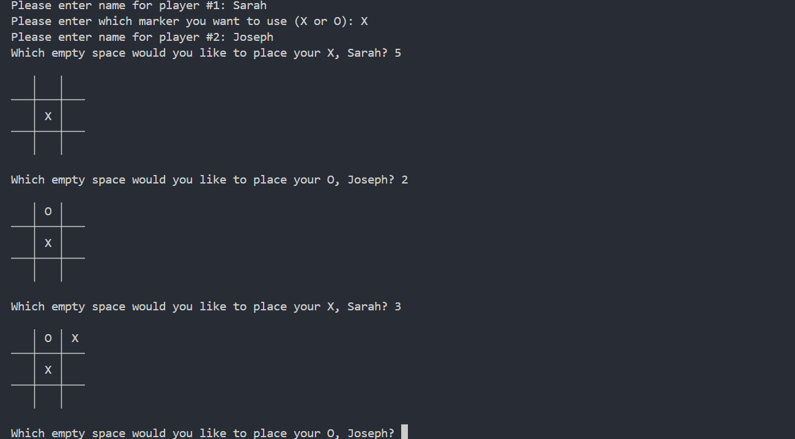
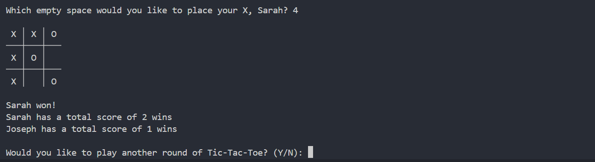

# Computer Science Projects - Portfolio Project: Python Terminal Game

This portfolio project was created as part of [Codecademy's](https://www.codecademy.com) Computer Science Career Path course.

## Table of contents

- [Project Overview](#project-overview)
  - [Project objectives](#project-objectives)
- [Python Terminal Game: Tic-Tac-Toe](#python-terminal-game-tic-tac-toe)
  - [Screenshots](#screenshots)
- [Process](#process)
  - [Coding decisions](#coding-decisions)
  - [What I learned](#what-i-learned)
  - [Potential improvements to program](#potential-improvements-to-program)
  - [Useful resources](#useful-resources)
- [Author](#author)

## Project Overview

"Welcome to the portfolio project in CS 101: Introduction to Programming! In this portfolio project, you will research, brainstorm, and build a basic terminal program of your choice for your friends and family to play with. After you finish building the program, you will create a blog post to share the program on a publication of your choice!" - [Codecademy](https://www.codecademy.com)

### Project objectives

- Build a terminal program using Python.
- Add at least one interactive feature using `input()`.
- Use Git version control.
- Use the command line and file navigation.
- Write a technical blog post on the project.

## Python Terminal Game: Tic-Tac-Toe

For this particular project I decided to create a Tic-Tac-Toe game.

- Solution URL: [Tic-Tac-Toe Game](./tic_tac_toe.py)

### Screenshots

#### Game instructions:



#### Players taking turns:



#### Overall scores:



## Process

- Think of an idea for the python terminal game: Tic-Tac-Toe game.
- Project brainstorming on how the game will work:
  - Game to be turn based for 2 players to play within a terminal.
  - Print out initial board game with instructions on how to play the game.
  - Get names of players and assign which player is using O (marker) and which player is using X (marker).
  - Play starts with each player taking turns stating location of where to place their marker.
  - After each turn, reprint board game to show where the placed markers are.
  - Check for when 3 matching markers are either in a row, column, or along a diagonal.
    - If yes, print winner information.
    - If all locations on board are full, print draw information.
    - If neither the above are true then continue the game with the next player taking their turn.
  - At the end of the game, get the answer as to whether players wish to play another round of the game.
    - If yes, reset game with same player information.
    - Otherwise end game.
  - Keep total score of overall wins for each player.
- Set up a GitHub repository.
- Set up Git version control.
- Write Tic-Tac-Toe game program.
- Refactor program.
- Create blog post about project. (This README file is my post about the project I have created.)

### Coding decisions

There are a number of decisions I made as to how to approach and code this game. So below is an explanation as to the what and why I wrote the code in the way that I did.

- As there are 2 players in the game I created a `class Player` to handle the player's `name`, `marker` (X or O) and `score`.
- Initialising the game overall is split into two parts - `init_player()` and `init_game()`. This is so that the game can be reset with `init_game()` with using the same players, if the players select that they wish to play another game.
- The grid board is drawn by using Unicode box drawing (line-drawing) characters. This created a nicer boxed image for the board.
- The use of a `counter` was used in several places in the program for the following reasons:
  - To determine whether `player1` (odd counter number) or `player2` (even counter number) is currently entering information.
  - `check_won()` is only called if `counter >=5` as that's the minimum amount of moves used between `player1` and `player2` before the first player can obtain 3 markers in a line.
  - `board_full = True` when `counter > 9` as that's the maximum amount of moves playable in a Tic-Tac-Toe game.
- Error checking is done for:
  - Input of player's name: `name` is not empty or only whitespace.
  - Input of player's marker: `marker` is only X or O (upper or lower case are both accepted).
  - Input of marker position `player_turn`:
    - Position number from 1 to 9 only
    - Position also has to be empty (i.e. with no marker already).

### What I learned

- There are Unicode codes for drawing lines that are useful for creating grid drawings in a terminal.
- How to return multiple variables.
- \ enables a line to be split into multiple lines without causing syntax errors (for easier readability)
- How to catch a value error with using:

  ```python
  try:
    ...
  except ValueError:
    ...
  ```

### Potential improvements to program

- Highlight the three markers that created the winning line.
  - This would make it more visually obvious which markers made the winning line.
  - Possible way of doing this, could be by changing the colour of the three winning markers when printed to the terminal screen.

### Useful resources

- [Wikipedia Article About Tic-Tac-Toe](https://en.wikipedia.org/wiki/Tic-tac-toe)
- [Wikipedia Article About Box Drawing Characters](https://en.wikipedia.org/wiki/Box-drawing_characters)

## Author

- V. Tickner
